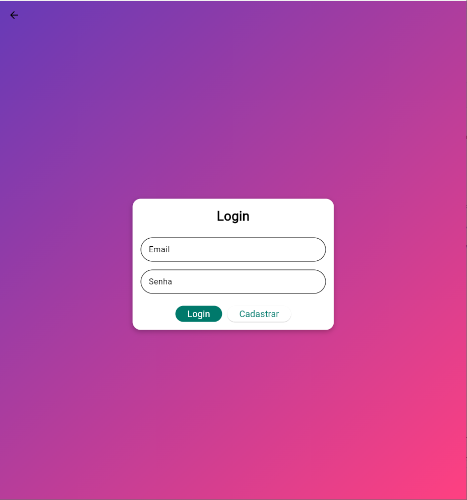
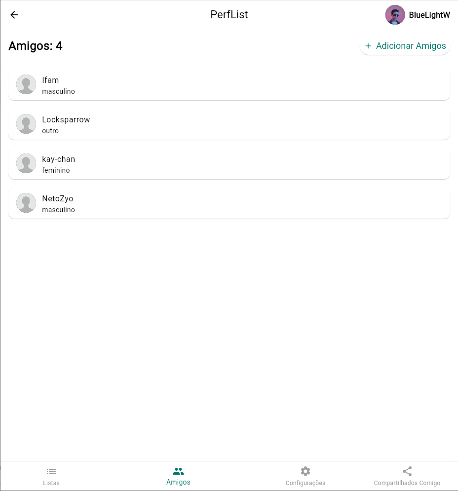
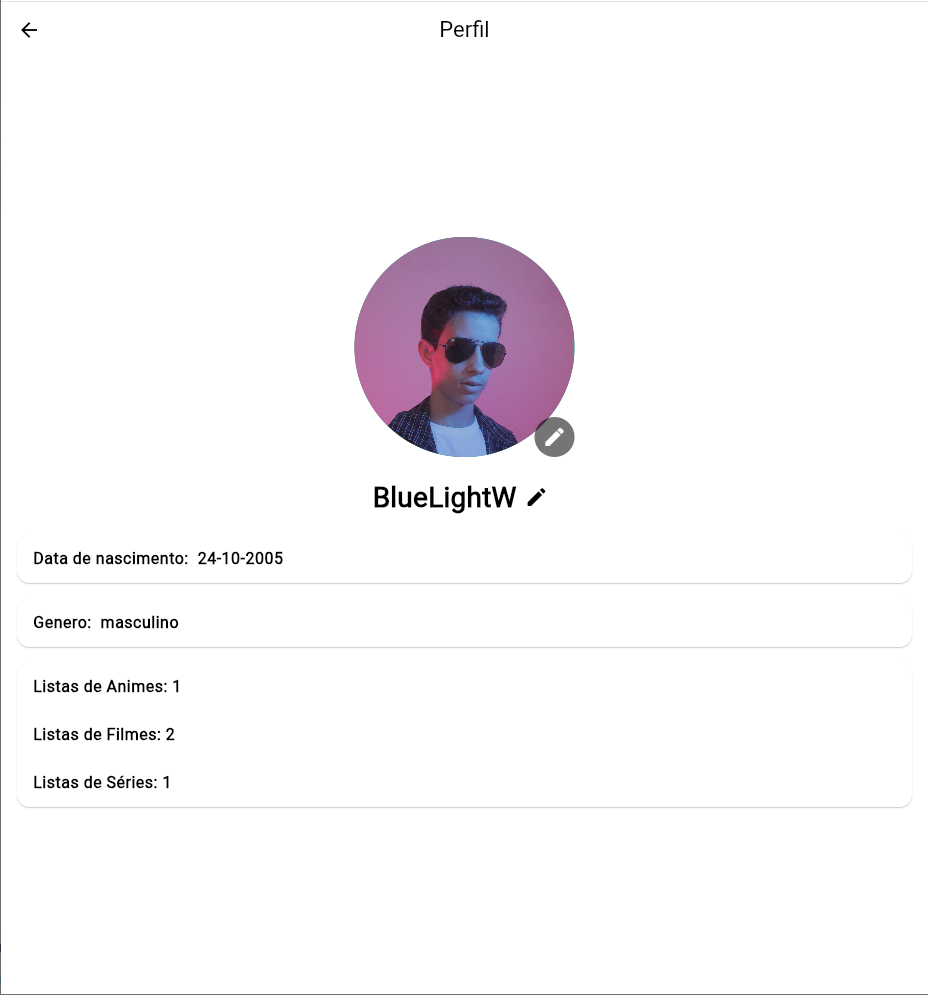
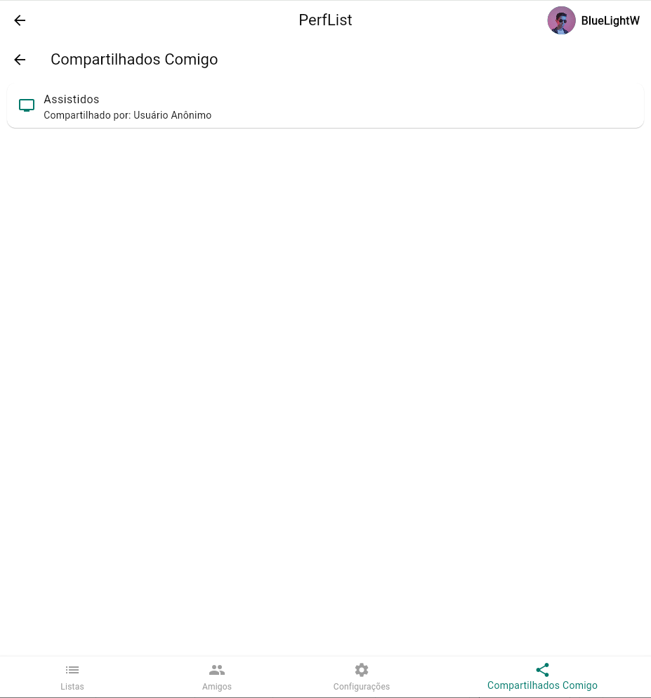
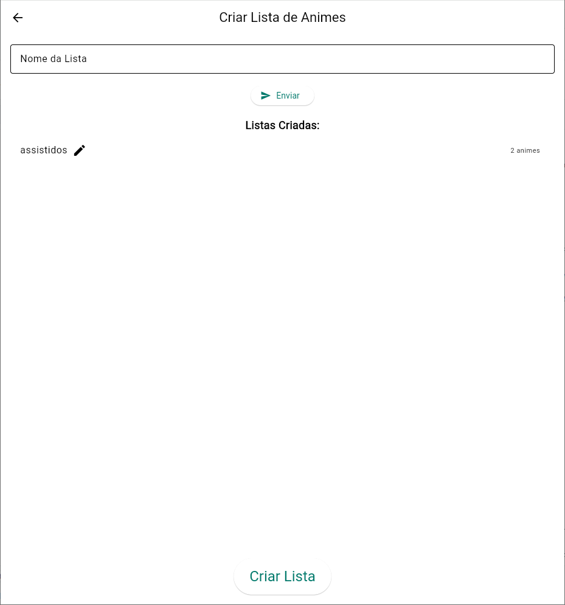
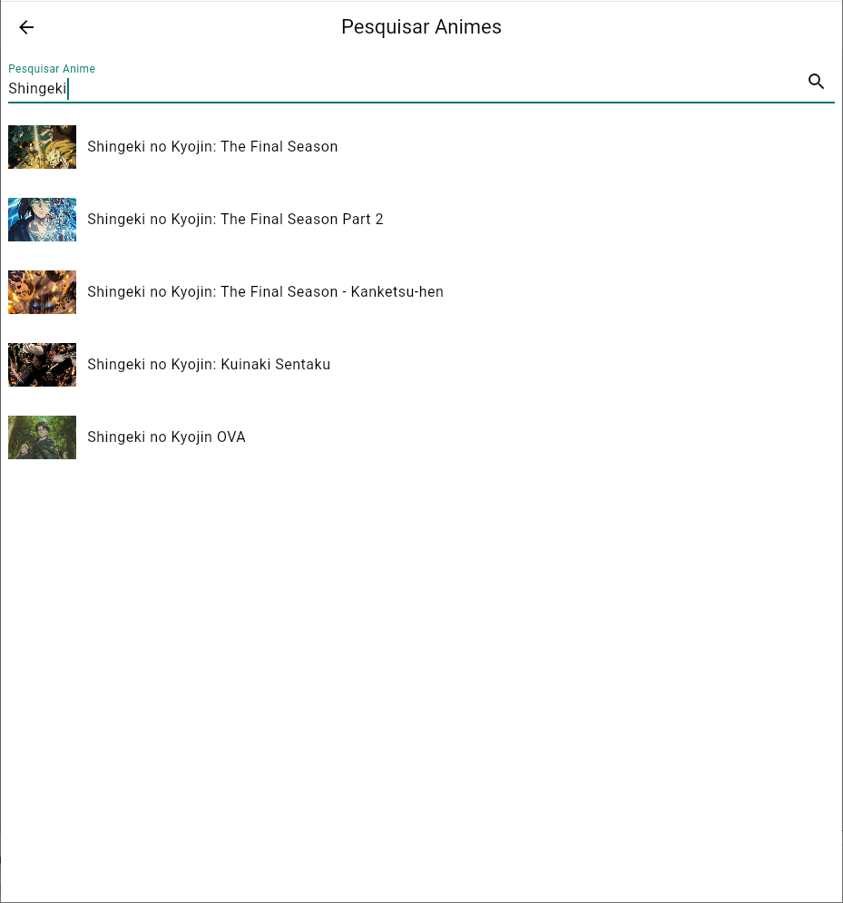

<<<<<<< HEAD
# perf_list

A new Flutter project.
=======
# PerfList - Gestão Colaborativa de Listas em Tempo Real 🚀

O **PerfList** é um projeto full-stack mobile desenvolvido para resolver o problema de organização de listas compartilhadas. Diferente de um simples bloco de notas, ele permite que grupos de amigos gerenciem listas de animes, filmes e séries com sincronização instantânea.

---

## 📸 Demonstração

| Tela de Login (Firebase Auth) | Adicionando Amigos | Perfil do Usuário | Lista Colaborativa (Cloud Firestore) | Criação de listas (Cloud Firestore) | Adicionando conteúdo (Consumo de API Externa) |
| :---: | :---: | :---: | :---: | :---: | :---: |
|  |  |  |  |  |  |
| *Autenticação segura via Firebase* | *Rede social de usuários* | *Exibição do perfil* | *Edição simultânea por múltiplos usuários* | *Utilização do banco de dados NoSQL do Firebase* | *Integração com API MyAnimeList* |

---

## 🛠️ Tecnologias e Especialidades aplicadas

Este projeto reflete minha especialidade no ecossistema **Firebase** e desenvolvimento **Mobile**:

* **Flutter (Dart):** UI reativa e fluida para Android/iOS/Web.
* **Firebase Authentication:** Fluxo completo de login e gestão de usuários.
* **Cloud Firestore:** Banco de dados NoSQL utilizado para a sincronização das listas em tempo real através de *Streams/Snapshots*.
* **Integração de API REST:** Consumo de dados dinâmicos da API do MyAnimeList para busca de metadados de animes.
* **Firebase Hosting:** Deploy da versão web do aplicativo.

---

## 🌟 Diferenciais Técnicos (O que aprendi)

1.  **Concorrência de Dados:** Implementação de lógica para evitar conflitos quando dois usuários editam o mesmo item da lista simultaneamente.
2.  **Arquitetura Serverless:** Toda a lógica de backend e armazenamento é gerida via Firebase, garantindo escalabilidade e baixo custo.
3.  **Experiência de Usuário (UX):** Feedback visual imediato ao adicionar ou remover itens, mesmo em conexões instáveis (Offline Persistence).

---

## ⚙️ Como rodar o projeto

1. Certifique-se de ter o Flutter instalado.
2. Clone o repositório: `git clone https://github.com/BlueLightW/PerfList.git`
3. Instale as dependências: `flutter pub get`
4. Configure seu projeto no console do Firebase e baixe o arquivo `google-services.json`.
5. Execute: `flutter run`

---
Desenvolvido por Cesar A. Avila - Conecte-se comigo no [LinkedIn](SEU_LINK_DO_LINKEDIN)
>>>>>>> 235f749fb2f2f7433704578791c8de7a8b5d09f9
